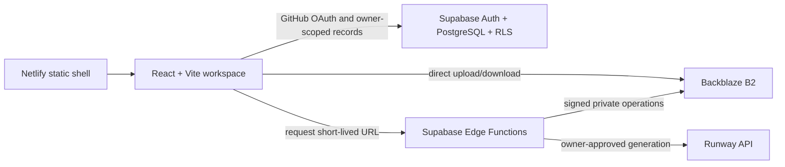

# StudioFlow

StudioFlow is a private production operating system for recurring AI-video series. It keeps the creative chain together: idea, script versions, production memory, scenes, shots, prompts, generation records, media, time, cost, and publication links.

The repository is public so the engineering journey can be shared. Production records and media are not public and must never be committed.

> Status: AI-1 through AI-5 are complete. One owner-approved Runway still and one separately confirmed five-second Runway video are privately stored in B2 with immutable inputs, lifecycle history, one canonical result link, and exactly one cost entry each. The video plays through StudioFlow at 720×1280 for 5.04 seconds and settled at 25 promotional credits/$0.25. Image generation now offers allowlisted one-image limits of 1 credit/$0.01 or 2 credits/$0.02. Generation and its scheduler are off. Shot handoff, immutable production-memory prompts, complete attempt details, and the encrypted version 2 backup/non-destructive restore rehearsal are complete. The exact reviewed commit is published to production with Auto Publishing locked; signed-out shell and health checks pass, and the owner reports that owner login and non-owner denial pass. Private-media expiry verification remains.

The local Quick Wins Phases 1–3 are complete: source-controlled private-mode configuration uses `VITE_SUPABASE_ANON_KEY`; shared error-boundary, toast, skeleton, and loading-spinner components are covered by focused tests; project-local formatting, commit-time checks, stricter TypeScript, and API documentation are in place; and environment validation, a minimal public health page, and bounded error monitoring are verified. No hosted configuration or deployment changed.

Netlify now serves the separately approved commit `b9238422931b9be125f52dc898ccb86f5513a53a` at `https://studioflowhq.netlify.app`. Deployment `6aa5fc5761abe6000824f5fd` is published and locked, while automatic publishing remains disabled. Do not publish a later commit without a new exact approval.

## What works

- Cinematic, compact Creator HQ for desktop, both iPad orientations, and phone quick capture.
- Projects, series, episode stages, immutable script versions, ordered scenes and shots, and a reusable 60–90 second sitcom structure.
- Characters, locations, props, and style memory with reusable prompt fragments.
- Local private-media demo with image, audio, and video preview.
- Retained media upload tasks with progress, pause, resume, retry, cancellation, and multipart completed-part recovery.
- Expiring private previews, purpose-specific downloads, editable media details, multi-context production links, recoverable trash, and confirmed deletion with orphan cleanup.
- Shot-aware immutable prompt history and complete manual generation provenance for provider, model, prompt version, shot, cost, duration, notes, linked result media, and selected/rejected decisions.
- Deterministic account-free image/video simulation with lifecycle history, cancellation, reload recovery, $0.00 fictional results, and a first-image rehearsal that requires confirmation of the exact Runway maximum. The local image gate offers reviewed 1-credit/$0.01 and 2-credit/$0.02 spending choices while retaining one output per request.
- Provider-neutral managed-generation contracts, atomic budget/storage reservations, append-only events, duplicate prevention, and deployed owner/internal-authenticated Runway recovery and private-ingest functions. The first private still and five-second video are live-verified. Source uses one bounded payload through 8 MiB or sequential 8 MiB multipart parts above it, exact-object retry reuse, post-upload verification, a 100-second deadline, and safe abort cleanup. Generation remains switched off between separately approved requests.
- Shot-to-generation handoff that combines shot direction, assigned characters/location, named props, and project style memory into a new immutable prompt before opening the confirmed generation gate.
- Expandable managed-attempt details for the exact request, immutable prompt, private input filenames, full lifecycle, result, and settled cost.
- Vault-backed, on-demand scheduled reconciliation that activates atomically with a claimed managed job and pauses again when no active job remains. Its credential and project URL remain server-only, and the hosted job is currently inactive after a successful empty-run rehearsal.
- Episode Media views that include direct uploads plus media linked through episode scenes, shots, and generation results.
- Cloud metadata saves retry once and roll back only the still-current optimistic change after a second failure. Managed-generation review updates only owner-editable fields, preserving the database's server-owned lifecycle guard.
- Time entries, cost entries, publication links, per-episode totals, metadata export, encrypted backup, and non-destructive restore rehearsal.
- Supabase schema, configured singleton owner allowlist, hardened row-level security, PKCE GitHub owner sign-in, pgTAP tests, and client error records.
- Race-safe owner authorization that treats verification errors as retryable failures instead of falsely labeling the signed-in owner as a non-owner.
- Backblaze B2 Edge Functions for signed upload, multipart resume/cancel/complete, private preview, permanent deletion, AES-256-GCM metadata backup, and owner-authenticated restore rehearsal.
- 8 GB warning, 9 GB upload block, 2 GB file maximum, and lifecycle-rule configuration.
- Live private B2 verification covering single upload, preview, download, trash/restore, multipart pause/resume, provider cancellation, encrypted version 2 backup/decryption/non-destructive restore, and exact test-data cleanup.
- Recoverable top-level render-error handling, typed success/error/info/warning notifications, and accessible shared loading states.
- Project-local formatting and staged-file quality gates, stricter TypeScript compilation, and an implementation-aligned API reference.
- Centralized browser-environment validation, fail-closed production startup, a public `/health` shell indicator, and sanitized in-memory error monitoring.

## Architecture



Ordinary large uploads never pass through Netlify or Supabase. One strictly bounded provider-generated result may pass through an internal Edge Function into private B2. Cloudflare is deliberately not part of this architecture.

## Start the fictional demo

Requirements: Node.js 24 and npm.

```powershell
npm install
npm run dev
```

Open `http://localhost:4173`. With no local `.env`, StudioFlow uses fictional browser-only data. Uploaded demo files remain in that browser's IndexedDB.

Open `http://localhost:4173/health` to view the public application-shell health result. It does not probe private services or owner data.

## Verification

```powershell
npm run verify
npm run format:check
npx playwright install chromium
npm run test:e2e
```

Database migrations and generated types are verified against the connected hosted Supabase project. The full isolated 80-assertion pgTAP suite passed in GitHub Actions and may also run on a capable development machine with Docker:

```powershell
npm run supabase:start
npm run supabase:test
npm run supabase:types
```

Docker is deliberately not installed on the current older desktop. See [docs/SETUP.md](docs/SETUP.md) for the hosted-development route; GitHub Actions supplies the isolated database-security gate.

## Configure the private workspace

Follow [docs/SETUP.md](docs/SETUP.md). Never commit `.env` files, OAuth secrets, B2 keys, database exports, or real media.

Important operational documents:

- [User guide](docs/USER-GUIDE.md)
- [Security model](docs/SECURITY.md)
- [Backup and restore](docs/BACKUP-RESTORE.md)
- [Production release gate](docs/PRODUCTION-RELEASE.md)
- [Ten-week learning rhythm](docs/BUILD-PLAN.md)
- [Architecture decisions](docs/ARCHITECTURE.md)
- [Milestone 9 workflow trial](docs/features/REAL_WORKFLOW_TRIAL_STATE.md)
- [AI image and video checkpoint](docs/features/AI_GENERATION_STATE.md)
- [AI image and video plan](docs/features/AI_GENERATION_PLAN.md)
- [Quick Wins and critical fixes checkpoint](docs/features/QUICK_WINS_STATE.md)
- [API reference](docs/API.md)

## Repository policy

- `main` must remain releasable; weekly work uses short-lived `week-N/...` branches and pull requests.
- Netlify Deploy Previews and the approved production deployment have separately scoped browser variables.
- Every later production deploy requires separate, explicit approval and protected-URL verification.
- The project intentionally has no license for now. Default copyright applies.

The first separately approved AI-3 still-image gate, scheduled reconciliation, and AI-4 five-second video gate are complete. The live video was below 8 MiB, so the bounded single-payload transfer ran; multipart remains mock-verified and will be exercised only when a later approved output naturally exceeds that threshold. Every additional provider request and later production release remains separately approved. Automatic posting, analytics imports, customer accounts, teams, billing, and the full editor remain later phases—not hidden version-one promises.
