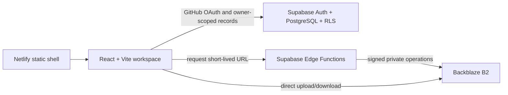

# StudioFlow

StudioFlow is a private production operating system for recurring AI-video series. It keeps the creative chain together: idea, script versions, production memory, scenes, shots, prompts, generation records, media, time, cost, and publication links.

The repository is public so the engineering journey can be shared. Production records and media are not public and must never be committed.

> Status: production-core implementation. The fictional local demo is ready. Supabase, Backblaze B2, GitHub OAuth, and Netlify accounts still need to be connected. No production deployment has been made.

## What works

- Cinematic, compact Creator HQ for desktop, both iPad orientations, and phone quick capture.
- Projects, series, episode stages, immutable script versions, ordered scenes and shots, and a reusable 60–90 second sitcom structure.
- Characters, locations, props, and style memory with reusable prompt fragments.
- Local private-media demo with image, audio, and video preview.
- Retained media upload tasks with progress, pause, resume, retry, cancellation, and multipart completed-part recovery.
- Expiring private previews, purpose-specific downloads, editable media details, multi-context production links, recoverable trash, and confirmed deletion with orphan cleanup.
- Shot-aware immutable prompt history and complete manual generation provenance for provider, model, prompt version, shot, cost, duration, notes, linked result media, and selected/rejected decisions.
- Episode Media views that include direct uploads plus media linked through episode scenes, shots, and generation results.
- Cloud metadata saves retry once and roll back only the still-current optimistic change after a second failure.
- Time entries, cost entries, publication links, per-episode totals, metadata export, and restore.
- Supabase schema, singleton owner allowlist, row-level security, pgTAP tests, and client error records.
- Backblaze B2 Edge Functions for signed upload, multipart resume/cancel/complete, private preview, permanent deletion, and AES-256-GCM metadata backup.
- 8 GB warning, 9 GB upload block, 2 GB file maximum, and lifecycle-rule configuration.

## Architecture



Large media never passes through Netlify or Supabase. Cloudflare is deliberately not part of this architecture.

## Start the fictional demo

Requirements: Node.js 24 and npm.

```powershell
npm install
npm run dev
```

Open `http://localhost:4173`. With no local `.env`, StudioFlow uses fictional browser-only data. Uploaded demo files remain in that browser's IndexedDB.

## Verification

```powershell
npm run verify
npx playwright install chromium
npm run test:e2e
```

The local Supabase database suite additionally requires Docker Desktop:

```powershell
npm run supabase:start
npm run supabase:test
npm run supabase:types
```

## Configure the private workspace

Follow [docs/SETUP.md](docs/SETUP.md). Never commit `.env` files, OAuth secrets, B2 keys, database exports, or real media.

Important operational documents:

- [Security model](docs/SECURITY.md)
- [Backup and restore](docs/BACKUP-RESTORE.md)
- [Production release gate](docs/PRODUCTION-RELEASE.md)
- [Ten-week learning rhythm](docs/BUILD-PLAN.md)
- [Architecture decisions](docs/ARCHITECTURE.md)
- [Milestone 9 workflow trial](docs/features/REAL_WORKFLOW_TRIAL_STATE.md)

## Repository policy

- `main` must remain releasable; weekly work uses short-lived `week-N/...` branches and pull requests.
- Netlify branch previews are allowed after configuration.
- Production deploys require a separate, explicit approval and a protected-URL verification.
- The project intentionally has no license for now. Default copyright applies.

AI generation, automatic posting, analytics imports, customer accounts, teams, billing, and the full editor are later phases—not hidden version-one promises.
