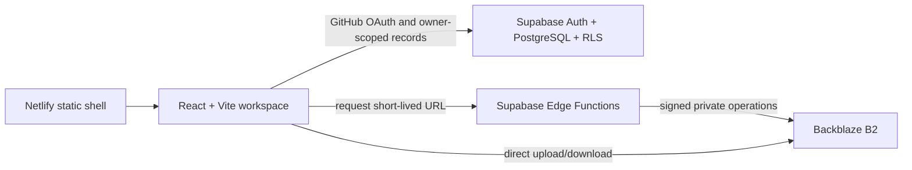

# StudioFlow

StudioFlow is a private production operating system for recurring AI-video series. It keeps the creative chain together: idea, script versions, production memory, scenes, shots, prompts, generation records, media, time, cost, and publication links.

The repository is public so the engineering journey can be shared. Production records and media are not public and must never be committed.

> Status: production core and live private-service integration are in the final Milestone 10F review. The private Netlify Deploy Preview contains the startup authorization fix from `20c7f44` and the fail-closed production-build guard from `5a56947`; its existing owner session, Creator HQ, direct routes, browser console, and all supported responsive sizes are verified. The application, 69 unit/component tests, production build, six guard checks, and all 32 Playwright scenarios pass. A fresh sign-out/sign-in, one tiny preview-origin media lifecycle check, and the Netlify production auto-publish lock remain before 10F can be called complete.

Netlify published one initial `main` build while the site was being created despite the repository production-ignore rule. That URL remains behind Netlify access control and has no production browser variables, but it is not an approved StudioFlow production release. Do not remove its protection or publish another production build without separate approval.

## What works

- Cinematic, compact Creator HQ for desktop, both iPad orientations, and phone quick capture.
- Projects, series, episode stages, immutable script versions, ordered scenes and shots, and a reusable 60–90 second sitcom structure.
- Characters, locations, props, and style memory with reusable prompt fragments.
- Local private-media demo with image, audio, and video preview.
- Retained media upload tasks with progress, pause, resume, retry, cancellation, and multipart completed-part recovery.
- Expiring private previews, purpose-specific downloads, editable media details, multi-context production links, recoverable trash, and confirmed deletion with orphan cleanup.
- Shot-aware immutable prompt history and complete manual generation provenance for provider, model, prompt version, shot, cost, duration, notes, linked result media, and selected/rejected decisions.
- Episode Media views that include direct uploads plus media linked through episode scenes, shots, and generation results.
- Cloud metadata saves retry once and roll back only the still-current optimistic change after a second failure.
- Time entries, cost entries, publication links, per-episode totals, metadata export, and restore.
- Supabase schema, configured singleton owner allowlist, hardened row-level security, verified GitHub owner sign-in, pgTAP tests, and client error records.
- Race-safe owner authorization that treats verification errors as retryable failures instead of falsely labeling the signed-in owner as a non-owner.
- Backblaze B2 Edge Functions for signed upload, multipart resume/cancel/complete, private preview, permanent deletion, and AES-256-GCM metadata backup.
- 8 GB warning, 9 GB upload block, 2 GB file maximum, and lifecycle-rule configuration.
- Live private B2 verification covering single upload, preview, download, trash/restore, multipart pause/resume, provider cancellation, encrypted backup/decryption/restore, and exact test-data cleanup.

## Architecture



Large media never passes through Netlify or Supabase. Cloudflare is deliberately not part of this architecture.

## Start the fictional demo

Requirements: Node.js 24 and npm.

```powershell
npm install
npm run dev
```

Open `http://localhost:4173`. With no local `.env`, StudioFlow uses fictional browser-only data. Uploaded demo files remain in that browser's IndexedDB.

## Verification

```powershell
npm run verify
npx playwright install chromium
npm run test:e2e
```

Database migrations and generated types are verified against the connected hosted Supabase project. The full isolated pgTAP suite passed in GitHub Actions and may also run on a capable development machine with Docker:

```powershell
npm run supabase:start
npm run supabase:test
npm run supabase:types
```

Docker is deliberately not installed on the current older desktop. See [docs/SETUP.md](docs/SETUP.md) for the hosted-development route; GitHub Actions supplies the isolated database-security gate.

## Configure the private workspace

Follow [docs/SETUP.md](docs/SETUP.md). Never commit `.env` files, OAuth secrets, B2 keys, database exports, or real media.

Important operational documents:

- [Security model](docs/SECURITY.md)
- [Backup and restore](docs/BACKUP-RESTORE.md)
- [Production release gate](docs/PRODUCTION-RELEASE.md)
- [Ten-week learning rhythm](docs/BUILD-PLAN.md)
- [Architecture decisions](docs/ARCHITECTURE.md)
- [Milestone 9 workflow trial](docs/features/REAL_WORKFLOW_TRIAL_STATE.md)
- [Proposed AI image and video plan](docs/features/AI_GENERATION_PLAN.md)

## Repository policy

- `main` must remain releasable; weekly work uses short-lived `week-N/...` branches and pull requests.
- Netlify Deploy Previews are configured with preview-only browser variables; production remains a separate approval gate.
- Production deploys require a separate, explicit approval and a protected-URL verification.
- The project intentionally has no license for now. Default copyright applies.

AI generation, automatic posting, analytics imports, customer accounts, teams, billing, and the full editor are later phases—not hidden version-one promises.
