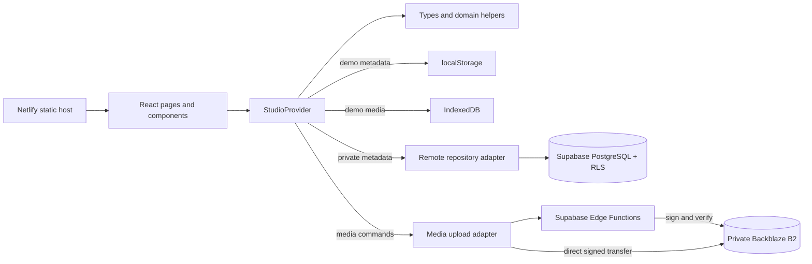
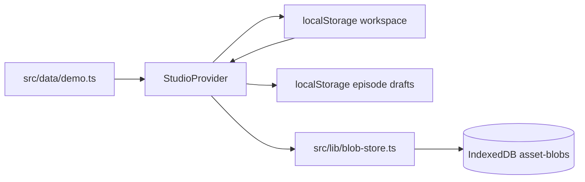
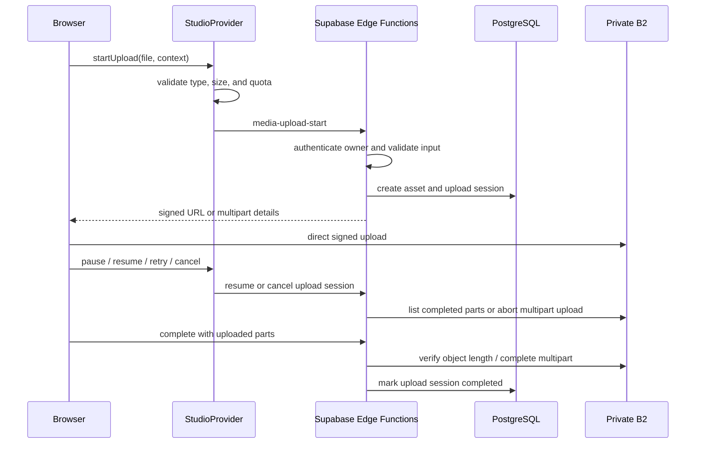

# StudioFlow Architecture

This document is the technical map of StudioFlow. Read it before changing application structure, persistence, authentication, media handling, build tooling, or deployment configuration.

It describes stable architecture only. Current work, temporary failures, blockers, and feature sequencing belong in `docs/PROJECT_STATE.md`.

## System overview

StudioFlow is a single TypeScript repository containing a React browser application, a Supabase database and Edge Function backend, Backblaze B2 media integration, automated tests, and Netlify build configuration.

The browser application supports two execution modes that share the same `WorkspaceData` domain model and the same UI:

1. **Fictional demo mode** persists metadata in localStorage and uploaded blobs in IndexedDB.
2. **Private workspace mode** persists metadata in Supabase PostgreSQL and media in private Backblaze B2 storage.

`StudioProvider` is the application command and state layer for both modes. It owns the in-memory workspace aggregate, exposes domain operations to pages and components, and delegates persistence to the correct adapter. Do not create a second global store or an independent persistence system for records already represented in `WorkspaceData`.



## Technology stack

| Layer | Technology | Responsibility |
| --- | --- | --- |
| Language | TypeScript | Shared browser, domain, configuration, and Edge Function implementation language |
| UI | React | Component rendering and interaction |
| Development/build | Vite | Local development server, module processing, and production bundle |
| Routing | React Router | Client-side route tree and nested application shell |
| Remote query infrastructure | TanStack Query | Query client and future/cache-aware server-state coordination |
| Validation | Zod | Validation at import and server-function input boundaries |
| Styling | Tailwind CSS Vite integration plus `src/styles.css` | Design tokens, responsive layout, shared component styles, and utility classes |
| Icons | Lucide React | Consistent interface iconography |
| Authentication | Supabase Auth with GitHub OAuth | Owner identity and authenticated sessions |
| Metadata database | Supabase PostgreSQL | Owner-scoped production records, relationships, constraints, history, and audit data |
| Authorization | PostgreSQL RLS plus `app_owners` | Anonymous and non-owner denial at the data layer |
| Server operations | Supabase Edge Functions | Owner verification, B2 signing, upload lifecycle, deletion, preview URLs, and backup |
| Media storage | Backblaze B2 through its S3-compatible API | Private images, audio, video, and encrypted metadata backups |
| Browser persistence | localStorage and IndexedDB through `idb` | Fictional demo metadata, episode drafts, and local demo blobs |
| Unit/component tests | Vitest, Testing Library, jsdom | Domain and React behavior |
| Browser tests | Playwright | End-to-end workflows and responsive viewport checks |
| Database tests | pgTAP through the Supabase CLI | Constraints, immutability, owner access, and RLS denial |
| Static hosting | Netlify | Production build output and SPA routing |
| CI | GitHub Actions | Application verification, database security tests, and secret scanning |

TanStack Query is initialized at the application root, but the current workspace loading and mutation path is coordinated by `StudioProvider` and `remote-repository.ts`. Adding query hooks does not authorize duplicating that persistence logic; any migration of server-state ownership must be intentional and repository-wide.

## Directory structure

```text
StudioFlow/
├─ .github/
│  ├─ ISSUE_TEMPLATE/           GitHub issue forms
│  ├─ workflows/ci.yml          Application, database, and secret-scan CI
│  ├─ dependabot.yml            Dependency update configuration
│  └─ PULL_REQUEST_TEMPLATE.md  Pull-request verification checklist
├─ docs/
│  ├─ ARCHITECTURE.md           This technical map
│  ├─ PROJECT_STATE.md          Evolving project dashboard
│  ├─ features/                 Frequently updated active-feature implementation state
│  ├─ BUILD-PLAN.md             Milestone and learning structure
│  ├─ SECURITY.md               Detailed security model
│  ├─ SETUP.md                  Local and provider configuration
│  ├─ BACKUP-RESTORE.md         Backup and restore procedure
│  └─ PRODUCTION-RELEASE.md     Preview and production release gate
├─ infra/
│  └─ b2-lifecycle-rules.json   B2 lifecycle policy source configuration
├─ scripts/
│  ├─ capture-previews.mjs      Local visual-preview capture helper
│  ├─ decrypt-backup.mjs        AES-GCM backup decryption helper
│  ├─ netlify-production-guard.mjs  Fail-closed production release gate
│  └─ netlify-production-guard.check.mjs  Production-gate regression tests
├─ src/
│  ├─ components/               Reusable shell, auth, status, media, and UI primitives
│  ├─ data/demo.ts              Fictional public demo workspace
│  ├─ lib/                      Persistence adapters, domain helpers, generated DB types, and utilities
│  ├─ pages/                    Route-level product screens
│  ├─ state/                    Workspace context, orchestration, persistence, uploads, and recovery
│  │  ├─ studio-store.tsx       Global application command composition
│  │  ├─ studio-context.ts      Public context contract
│  │  ├─ workspace-state.ts     Synchronous current-workspace state wrapper
│  │  ├─ workspace-persistence.ts  Demo storage and export validation
│  │  ├─ use-upload-manager.ts  Upload lifecycle controller
│  │  └─ cloud-save.ts          Remote retry and guarded rollback helpers
│  ├─ test/setup.ts             Vitest browser-test setup
│  ├─ App.tsx                   Route definitions
│  ├─ App.test.tsx              Application component coverage
│  ├─ main.tsx                  React bootstrap and top-level providers
│  ├─ styles.css                Design tokens and shared styles
│  └─ types.ts                  Canonical client domain model
├─ supabase/
│  ├─ functions/                Authenticated Edge Functions and shared B2/auth helpers
│  ├─ migrations/               PostgreSQL schema, constraints, triggers, indexes, and RLS
│  ├─ tests/database/           pgTAP authorization and production-rule tests
│  ├─ config.toml               Local Supabase configuration
│  └─ seed.sql                  Fictional local database seed
├─ tests/e2e/                   Playwright browser workflows
├─ CODEX.md                     Permanent agent instructions
├─ README.md                    Product and repository entry point
├─ package.json                 Dependency and command manifest
├─ package-lock.json            Locked npm dependency graph
├─ vite.config.ts               Vite, Tailwind, and Vitest configuration
├─ playwright.config.ts         Browser projects and local web server
├─ netlify.toml                 Static build, SPA redirects, and response headers
├─ tsconfig*.json               TypeScript project references and compiler settings
└─ eslint.config.js             Lint configuration
```

## Browser application composition

### Bootstrap and providers

`src/main.tsx` mounts the application and establishes the provider order:

```text
StrictMode
└─ ErrorBoundary
   └─ QueryClientProvider
      └─ BrowserRouter
         └─ StudioProvider
            └─ App
```

- `ErrorBoundary` catches render failures.
- the query client defines shared remote-query defaults.
- `BrowserRouter` supplies client routing.
- `StudioProvider` supplies authentication state, workspace records, notices, and application commands.
- the global `unhandledrejection` listener routes uncaught promise failures through the client error recorder.

### Routing and shell

`src/App.tsx` places all product routes behind `AuthGate` and inside `AppShell`.

| Route | Page responsibility |
| --- | --- |
| `/` | Creator HQ dashboard |
| `/projects` | Project collection |
| `/projects/:projectId` | Project overview and series |
| `/series/:seriesId` | Series episodes and production context |
| `/episodes/:episodeId` | Episode brief, script, scenes, shots, media, provenance, time, cost, and publication |
| `/library` | Character, location, prop, and style production memory |
| `/media` | Asset library and lifecycle controls |
| `/settings` | Workspace status, export, and restore controls |

Unknown paths redirect to `/`.

### Application state and commands

`src/state/studio-store.tsx` remains the client orchestration layer and composes focused state modules:

- `studio-context.ts` defines the public command and state contract consumed by pages.
- `workspace-state.ts` keeps consecutive commands on the latest in-memory `WorkspaceData` value.
- `workspace-persistence.ts` owns demo localStorage, export validation, compatibility normalization, timestamps, and record identifiers.
- `use-upload-manager.ts` owns upload task execution and lifecycle state.
- `cloud-save.ts` owns one automatic retry and guarded rollback helpers for remote metadata failures.
- `studio-store.tsx` composes authentication, notices, record commands, mode-aware persistence, import/export, and these focused modules.

Pages consume the store through `useStudio()`. Domain calculations that do not require React belong in `src/lib/domain.ts`; record shapes belong in `src/types.ts`.

## Domain and persistence model

### Canonical client aggregate

`WorkspaceData` is the client representation of a complete owner workspace. It contains arrays of:

- projects and series
- episodes and script versions
- scenes and shots
- production entities
- assets and asset links
- prompt versions and generation records
- ordered generation inputs, append-only generation events, and owner generation-budget settings
- time entries and cost entries
- publications and quick captures

Client property names use camelCase. PostgreSQL columns use snake_case. `remote-repository.ts` owns the table mapping and key conversion between those representations.

Explicit `asset_links` rows are the canonical relationship between a generation record and its result media. `generation_records.asset_ids` remains a backward-compatible projection for existing exports and clients. Browser commands update both representations together; PostgreSQL triggers synchronize them in either direction and reject duplicate or cross-project result references.

### Demo-mode persistence

Demo mode is active when `VITE_DEMO_MODE` is true or Supabase browser configuration is absent.



- `studioflow-demo-workspace-v1` stores fictional workspace metadata.
- `studioflow-episode-drafts-v1` stores working episode and script drafts.
- `studioflow-private-media` is the IndexedDB database for locally uploaded demo blobs.
- `src/data/demo.ts` is the safe fallback when no saved demo workspace exists or stored JSON cannot be parsed.

Demo mode must remain functional without external accounts or environment variables. Demo data must remain fictional and safe for the public repository.

### Private-workspace persistence

Private mode requires `VITE_SUPABASE_URL` and `VITE_SUPABASE_PUBLISHABLE_KEY`, with demo mode disabled.

1. `supabase.ts` creates the browser client and performs GitHub OAuth.
2. `StudioProvider` observes the Supabase session.
3. It calls the no-argument `current_user_is_app_owner()` self-check. The browser cannot supply an arbitrary UUID.
4. `AuthGate` exposes the application only when the owner check succeeds.
5. `loadRemoteWorkspace()` reads every mapped owner table in parallel and converts rows to the client model.
6. Store commands update the in-memory aggregate and call `upsertRemoteRecord()` for remote persistence.
7. Generation-result commands persist the explicit asset link; database triggers synchronize the compatible generation result array.
8. Managed generation commands use provider-neutral browser/domain contracts. Account-free demo work uses the deterministic fake provider; private provider execution is owned by authenticated Edge Functions and PostgreSQL claims rather than by the browser.
9. PostgreSQL constraints, triggers, and RLS enforce rules independently of the browser.

The browser's route guard improves experience; it is not the authorization boundary. Direct database requests must remain protected by RLS and the singleton owner check.

## Major backend systems

### PostgreSQL schema and authorization

The migration under `supabase/migrations/` defines:

- enum and table definitions
- foreign keys, indexes, uniqueness, and validation constraints
- immutable script and prompt triggers
- media quota enforcement
- the singleton `app_owners` allowlist
- owner-scoped row-level security policies
- backup and client-error metadata tables

Every production record that belongs to a workspace carries `owner_id`. Owner access requires both `owner_id = auth.uid()` and the private `private.is_app_owner()` helper. The helper derives identity only from `auth.uid()` and is not exposed through the API schema. Authenticated clients may call only the security-invoker `current_user_is_app_owner()` self-check; anonymous access is revoked.

### Edge Function boundary

`supabase/functions/_shared/auth.ts` authenticates the bearer token and verifies the singleton owner before returning privileged database access. Edge Functions must use this helper rather than independently inventing authorization.

`supabase/functions/_shared/b2.ts` owns B2 client creation, bucket lookup, storage-key construction, media limits, multipart constants, and server-side MIME validation. Media functions reuse these values and helpers.

Managed AI orchestration is split deliberately:

- `src/lib/generation-provider.ts` defines provider-neutral capabilities, requests, estimates, jobs, and normalized results. `src/lib/managed-generation.ts` owns the pure lifecycle, reservation, interruption, and idempotent demo rules.
- `src/state/use-generation-manager.ts` runs the deterministic account-free simulation and refreshes visible private job state. It does not hold an AI credential or call a real provider.
- `supabase/functions/_shared/runway.ts` is the first provider adapter. AI-2 verifies it only with mocked HTTP; no Runway credential or live request is part of that checkpoint.
- `generation-start` and `generation-cancel` require the authenticated singleton owner and accept only a generation ID. The server reloads the immutable prompt, settings, inputs, and pricing context before acting.
- `generation-reconcile` uses a separate internal-service credential, accepts no caller-supplied record identifiers, selects due singleton-owner rows itself, and applies bounded polling/recovery.
- `generation-ingest` is internal-only and accepts only a generation ID. It retrieves the provider result through the adapter, keeps the temporary URL in memory, verifies an exact HTTPS host with redirects disabled, then streams at most the persisted output reservation into private B2.

Provider-only signed reference URLs and temporary generated-output URLs are never returned to the browser, written to PostgreSQL, included in exports/backups, or logged. The real-generation switch remains false through AI-2.

### Media lifecycle

Media metadata lives in PostgreSQL; media bytes live in B2.



- Files at or below the single-upload threshold receive a short-lived signed PUT URL.
- Larger files use multipart upload sessions and signed part URLs.
- Upload-task state lives in `StudioProvider`, so progress and lifecycle controls survive route navigation. On resume, the browser asks the provider for completed parts and transfers only missing parts.
- Preview/download requests use `media-url` and return short-lived signed GET URLs with inline or attachment disposition. Preview access refreshes before expiry and once after a playback failure.
- One asset can have multiple validated `asset_links`; each target must exist in the same owner workspace.
- Permanent deletion requires the metadata record to be in trash first. The server cleanup transaction removes explicit links and asset IDs embedded in shots, entities, and generation records.
- B2 lifecycle rules live in `infra/b2-lifecycle-rules.json`.

The browser must never receive B2 application credentials. Ordinary large media must never be proxied through Netlify or Supabase.

Generated provider results are the narrow exception to the ordinary direct browser/B2 transfer rule. They are not ordinary 2 GB uploads: one internal Edge invocation streams a single generated image or video through a bounded 250 MB-or-lower reservation, with a required direct `200`, declared length, approved MIME type, exact provider hostname, and no redirects. The metadata completion transaction uses the generation ID as its idempotent asset identity and creates at most one asset, one canonical asset link, and one linked cost entry.

### Backup and error recording

- `metadata-backup` reads owner-scoped records, including generation inputs, lifecycle events, budget settings, and linked costs, creates an import-compatible version 2 workspace package, encrypts it with AES-256-GCM, and writes the encrypted object to private B2 storage.
- `scripts/decrypt-backup.mjs` is the local decryption tool. The key remains outside the repository.
- `recordClientError()` records a bounded error message, context, route, and user agent for authenticated users. It must not include scripts, prompts, form values, signed URLs, or media content.

## Data flow by operation

### Metadata read

```text
route/page -> useStudio() -> in-memory WorkspaceData
                              ^
                              |
                  demo localStorage or Supabase table load
```

Pages do not query PostgreSQL tables independently for existing workspace records. New read models should either derive from `WorkspaceData` or be introduced through an intentional store/repository design change.

### Metadata mutation

```text
page event -> StudioProvider command -> update WorkspaceData
                                    -> demo: localStorage effect
                                    -> private: remote-repository upsert
                                                -> retry once on failure
                                                -> guarded local rollback after second failure
```

Database constraints and RLS remain authoritative even when the client updates optimistically. Rollback uses object identity so a failed older request cannot overwrite a newer local edit. Destructive remote operations remain pessimistic: local deletion occurs only after the provider operation succeeds.

Generation result linking is one specialized mutation: the browser updates the explicit asset link and compatible result array together, while private persistence writes the canonical `asset_links` record. PostgreSQL validates owner/project context and synchronizes `generation_records.asset_ids`. Removing a result link completes remotely before the browser removes the local relationship.

### Media preview

```text
MediaPreview
├─ demo mode    -> IndexedDB blob -> temporary object URL
└─ private mode -> media-url Edge Function -> expiring signed B2 URL
```

Object URLs created for demo blobs must be revoked when the component is released.
Private preview URLs are refreshed shortly before expiry. Downloads request attachment disposition rather than reusing preview access.

### Export and import

- Export serializes the `WorkspaceData` aggregate as JSON and downloads it locally.
- Import validates the structural envelope with Zod.
- Imported owner IDs are normalized to the currently active owner.
- Older workspaces without `assetLinks` normalize that collection to an empty array while preserving unknown fields.
- Restore writes generation records before asset links so polymorphic generation targets exist before their links are validated.
- Asset-link upserts reconcile on `(asset_id, target_type, target_id)`, allowing a database-synchronized compatibility link and its imported explicit link to resolve as one relationship.
- In private mode, normalized records are persisted through the repository adapter before the imported workspace replaces current local state. Each record retries once; failure stops the restore and attempts to reload the authoritative remote workspace.

Schema evolution must retain a migration or normalization path for previously exported workspaces.

## Source files and generated files

### Source-controlled inputs

These files are authored and reviewed as source:

- `src/` except generated database types
- `supabase/migrations/`, `supabase/functions/`, `supabase/tests/`, and `supabase/seed.sql`
- `tests/`
- `docs/`, `CODEX.md`, and repository policy files
- `infra/` and `scripts/`
- Vite, TypeScript, ESLint, Playwright, Netlify, npm, and CI configuration
- `.env.example`, which contains names and placeholders only

### Generated but committed

- `package-lock.json` is generated by npm and committed to make dependency resolution reproducible. Change it through npm operations rather than hand-editing dependency graph entries.
- `src/lib/database.types.ts` is generated from the verified Supabase schema and committed for compile-time database safety. Regenerate it with `npm run supabase:types`; do not maintain it as a competing hand-authored schema.

### Generated and ignored

The following are disposable outputs or machine-local state and must not become source:

- `node_modules/`
- `dist/`
- `coverage/`
- `playwright-report/`
- `test-results/`
- `.netlify/`
- `.supabase/`, `supabase/.branches/`, and `supabase/.temp/`
- `.env`, `.env.*` other than `.env.example`
- `*.local`, `*.log`, operating-system metadata, and editor-local state

Real media, exports, encrypted backups, decrypted backups, provider credentials, and production identifiers are private data, not build artifacts, and must never enter the repository.

## Build and verification pipeline

### Local development

```text
npm install
  -> package-lock.json selects exact dependencies

npm run dev
  -> Vite development server on port 4173
  -> React fast refresh and Tailwind processing
```

### Standard application verification

`npm run verify` runs:

```text
TypeScript project build/type-check
  -> ESLint
  -> Vitest unit and component tests in jsdom
  -> Node production-release guard tests
  -> production TypeScript build
  -> Vite production bundle in dist/
```

`npm run test:e2e` starts or reuses the Vite server and runs Playwright against desktop, iPad landscape, iPad portrait, and 390 x 844 phone projects.

### Database verification

The current older desktop does not run Docker. It applies only reviewed, committed migrations to the connected hosted Supabase project, regenerates types from that verified hosted schema, and runs Supabase security and performance advisors. Mutating pgTAP fixtures do not run against the hosted project.

GitHub Actions or a separately approved capable development host performs the isolated local-stack path:

```text
npm run supabase:start
  -> local Supabase services through Docker

npm run supabase:test
  -> pgTAP migration, RLS, owner-denial, constraint, and immutability tests

npm run supabase:types
  -> regenerates src/lib/database.types.ts from the local schema
```

### Continuous integration

GitHub Actions contains three independent jobs:

1. **Application:** install from lockfile, audit runtime dependencies, run `npm run verify`, install Chromium, and run Playwright.
2. **Database security:** start an isolated local Supabase stack, run pgTAP tests, and stop the stack. This remains the authoritative mutating database-test gate for the no-Docker desktop workflow.
3. **Secret scan:** run Gitleaks across repository history.

CI validates code; it does not deploy production.

Netlify Deploy Previews use the standard build command. Production context has two repository-level defenses: the `ignore` command asks Netlify to skip ordinary production builds, and the production build command exits unsuccessfully unless the separately managed `STUDIOFLOW_PRODUCTION_RELEASE_COMMIT` value is a full 40-character SHA matching Netlify's current `COMMIT_REF`. Netlify's provider-level auto-publish lock remains the authoritative promotion gate; the repository checks are defense in depth.

### Netlify build

Netlify uses Node 24 and publishes `dist/`. Deploy Previews run `npm run build`; production runs the commit-bound release guard first and reaches `npm run build` only for the one exact authorized commit. The catch-all redirect returns `index.html` for React Router paths. Security headers are defined in `netlify.toml`.

Repository configuration or CI must not automatically promote a build to production. Preview and production release permissions are governed by `docs/PRODUCTION-RELEASE.md`.

## Architectural invariants

The following rules must remain true unless the owner explicitly approves an architecture change and the affected documentation, migrations, and tests are updated together:

1. **One client domain model:** `WorkspaceData` and the types in `src/types.ts` are the canonical client record model.
2. **One application command layer:** pages and components mutate workspace records through `StudioProvider`; do not add an unrelated global store or direct persistence path for the same records.
3. **Two explicit persistence modes:** fictional demo storage is browser-local; the private workspace uses Supabase for metadata and B2 for media. Both modes present the same domain model to the UI.
4. **Owner enforcement is server-side:** route guards are not sufficient. Owner-scoped tables require indexed `owner_id`, RLS, and the singleton allowlist.
5. **Privileged functions authenticate by purpose:** browser-started Edge Functions verify the bearer token and configured owner. Internal generation recovery/ingest uses a distinct server-only secret, accepts no caller-supplied owner or storage context, and selects or reloads records itself.
6. **Media bytes bypass application hosting:** browser-to-B2 signed transfer is mandatory for ordinary large files. The only proxy exception is bounded internal streaming of a provider-generated result directly into private B2; temporary provider URLs never cross into product state.
7. **B2 remains private:** browser access uses short-lived, purpose-specific signed URLs. Credentials never enter the browser bundle.
8. **History is append-only:** script and prompt revisions create new records and remain immutable at the database layer.
9. **Storage safety is enforced twice:** media type, non-empty size, 2 GB maximum, and 9 GB cap are validated before upload and enforced by server/database rules.
10. **Deletion is staged:** current media is not automatically deleted; permanent deletion follows trash and explicit user intent.
11. **Demo mode remains account-free:** the fictional workspace must boot and function without Supabase, B2, OAuth, or Netlify configuration.
12. **Stored data remains migratable:** schema, import, and domain changes preserve backward compatibility or provide an explicit migration/normalization path.
13. **Generated outputs are replaceable:** source code and migrations generate bundles and types; generated build directories are never edited as authoritative source.
14. **Cloudflare is excluded:** do not add Workers, D1, R2, Pages, or account-level Cloudflare dependencies.
15. **Build is not deployment:** tests, CI, and preview builds do not authorize or imply a production release.
16. **Failed cloud writes reconcile visibly:** ordinary metadata writes retry once and roll back only the still-current optimistic change after a second failure. Newer local edits are never overwritten by an older rollback.
17. **Generation results have one canonical relationship:** explicit asset links are authoritative; the generation result-ID array remains synchronized only for backward compatibility and export continuity.
18. **Managed generation is provider-neutral and server-owned:** browser/domain code uses normalized contracts; adapters translate provider fields only on the server; atomic claims, reservations, lifecycle transitions, and idempotency constraints remain authoritative in PostgreSQL.
19. **AI-2 is inert by default:** the fake provider is account-free, the Runway adapter is mock-tested, `generation_enabled` is false, and no live provider key, request, scheduler, function deployment, or production promotion is implied.

## When to update this document

Update `docs/ARCHITECTURE.md` only when the actual application structure changes, such as:

- adding, removing, or replacing a technology or provider
- changing the ownership of global state or persistence
- changing directory responsibilities
- adding a major subsystem or data flow
- changing generated/source file boundaries
- changing the build, CI, hosting, or deployment pipeline
- adding, removing, or revising an architectural invariant

Do not update this document for current task status, temporary bugs, individual assignments, feature backlog, or chronological implementation history.
